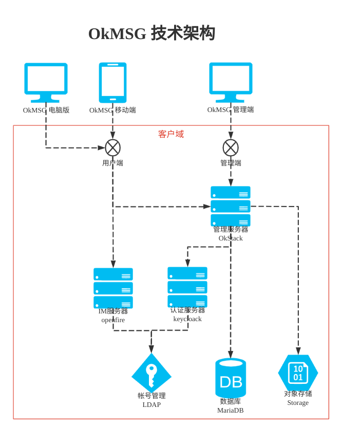

<h1 align="center">👑 OkStack 👑</h1>

  
  
  
  
  

# 🎁 项目介绍

**OkStack是由OkStar(okstar.org)社区开发和维护的支持企业业务的通用管理平台，OkMSG相关所有数据操作统一由OkStack服务端（OkStack）管理，企业管理人员在OkMSG管理端中拥有对所有数据、业务和产品的完全管控能力,同时拥有更新的技术和性能。**
- 具备跨平台、拓展性。
- 可独立部署私有化系统。
- 兼容Windows、Linux等平台。

# 🧭 功能介绍
**企业管理平台后端**

# 🏢 软件架构

# 🖼️ 界面展示
- 规划中

# ⛽ 第三方库
- Eclipse MicroProfile 微服务规范
- Quarkus 2.16.x
- Hibernate 5.x
- Vert.x
- RESTEasy
- Netty
- Apache Camel

# 🖥️ 支持平台
- 🐧 Linux
- 🪟 Windows
- Java 17

# ⚙️ 部署文档
> 具体参考：[docs/deployment.md](docs/deployment.md)

# ⚒️ 任务计划
> 【金山文档】 OkStar社区任务列表 https://kdocs.cn/l/csib86aYwx0P

# 🏭 社区建设

> 为了OkStar社区能长期有序有质量发展，诚邀有梦想情怀人士加入，一起建设社区，
> 目前规划需要如下方面人才：

- 开发、问题反馈、 Bug修复
- 文档、翻译、设计、品控
- 支持、推广、投资、项目管理
- 欢迎加入 [OkStar 社区](http://okstar.org)

# 🧑‍🤝‍🧑 贡献者
- [贡献者列表](https://gitee.com/okstar-org/ok-stack-backend/contributors?ref=master)

# 💰 赞助商

- Joy1024（个人）

# 📦 欢迎体验
请访问公司官网了解，👉 [船山信息](https://www.chuanshaninfo.com)。

# ☎️ 联系我们

> 技术交流群，添加微信：**okstar-org**（备注：**OkStar** 姓名）

   

> 微信公众号，关注账号：**TheOkStarOrg**

   

# 🙏 感谢支持
- 感谢配合测试的同学，有赵慧、戴斌、沈雪琪等
- [感谢 JetBrains 对本项目的支持（Drive by JetBrains）](https://jb.gg/OpenSourceSupport) 

# ❤️ 捐赠方式

> 您的捐款是OkEDU开源项目持续前进的动力，希望该项目可以让任何人从中受益。
> 捐赠列表👉 https://kdocs.cn/l/cr7rVyXnbxuK

 

> 欢迎大家 Clone 本项目，捐赠收入将用于对贡献者的奖励。

# ©️ 版权信息

> 本项目采用双重授权，请按合规正确使用本项目！

1.遵循软件分发协议
  - 国际：**[GPL-2.0](https://opensource.org/license/gpl-2-0/)**
  - 中国：**[木兰公共许可证, 第2版](http://license.coscl.org.cn/MulanPubL-2.0)**

2.付费得到商业授权（试行）
- [OKEDU软件合作伙伴合同-个人版](https://www.kdocs.cn/l/cgdtyImooeol)
- [企业版软件授权，请移步👉 chuanshaninfo.com](https://www.chuanshaninfo.com/)
