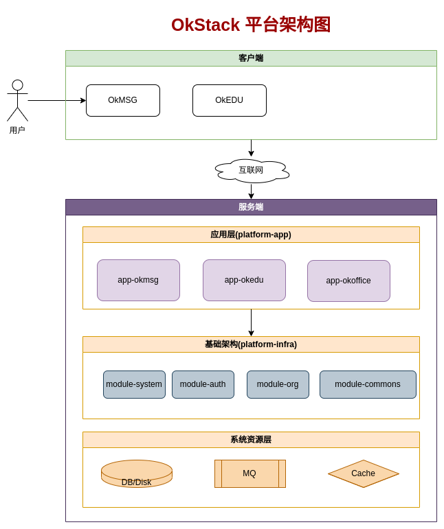

<h1 align="center">👑 OkStack-Platform 👑</h1>

  
  
  
  
  

# 🎁 项目介绍

**OkStack由OkStar社区开发，基于Quarkus微服务云原生框架的后台管理系统，为OkMSG、OkEDU等提供数据、控制等管理服务。**
- 具备跨平台、拓展性。
- 可独立部署私有化系统。
- 兼容Windows、Linux等平台。

# 🧭 功能介绍
**企业管理平台后端**

# 🏢 软件架构

# 🖼️ 界面展示

# ⛽ 第三方库
- Eclipse MicroProfile 微服务规范
- Quarkus 2.16.x
- Hibernate 5.x
- Vert.x
- RESTEasy
- Netty
- Apache Camel

# 🖥️ 支持平台
- 🐧 Linux
- 🪟 Windows

# ⚙️ 构建开发
参考：[buildings.md](docs%2Fbuildings.md)

# ⚒️ 开发规范

- OkStar E-L2 工程规范 https://kdocs.cn/l/ceubs3oJDxzc
- 开发者规约（进行中）

# 🗓️ 版本规则
- 社区版本： 
  - 规则：{项目代号}-v{第1位}.{第2位}.{第3位}[-RC位]
  - 比如：如：OkEDU-v1.0.0、OkEDU-v1.0.0-rc；
  - 用户：面向公众、入门级用户、衍生专业版；
  - 维护者：社区；
- 专业版本：
  - 规则：{项目代号}-{yyMM}.{SP}-{PVD}-LTS
  - 比如：OkEDU-2410.5-HNCS-TLS；
  - 用户：面向客户、大型企业；
  - 维护者：社区+合作伙伴；
  
- 规则说明： 
  - 第1位：标识重大架构级变更（架构调整、接口改变、不兼容等变化）； 
  - 第2位：标识重要功能添加等（兼容主版本）； 
  - 第3位：标识bug修复、小范围优化等； 
  - RC位：表示候选版本，发布前的自测试阶段标识;
  - yyMM: 基于社区当前发布的版本年月；
  - SP：Service Pack 服务包序列，修复系统中的漏洞和问题、稳定性和优化等。
  - PVD：Provider 供应商，即合作伙伴代号；

# ⏰ 任务规划
- 2023年 
  1. 完成项目基本功能 
  2. 开启社区基本建设
  3. 开启社区项目内测
- 2024年
  1. 完成对各系统平台的支持
  2. 登录到各平台面向消费者
  3. 开启商业定制之路

> 【金山文档】 OkEDU任务列表 https://kdocs.cn/l/csib86aYwx0P

# 🏭 社区建设

> 为了OkEDU项目能长期有序有质量发展，诚邀有梦想情怀人士加入，一起建设社区，
> 目前规划需要如下方面人才：

- 开发、问题反馈、 Bug修复
- 文档、翻译、设计、品控
- 支持、推广、投资、项目管理

> 社区模式：敬请期待。。。
- 欢迎加入 [OkStar 社区](http://okstar.org)

# 🧑‍🤝‍🧑 贡献者
> 欢迎加入参与社区建设
- Joy1024
- 赵慧
- [更多](https://gitee.com/okstar-org/ok-stack-backend/contributors?ref=master)

# 💰 赞助商

- Joy1024（个人）

# 📦 欢迎体验
- 下载地址：https://www.chuanshaninfo.com/download/OkEDU/
- 测试帐号：ok_1001到ok_1005，密码:okedu
- 更多请加微信：chuanshantech

# ☎️ 联系我们

> 技术交流群，添加微信：**okstar-org**（备注：**OkStar** 姓名）

   

> 微信公众号，关注账号：**OkEDU**

   

# 🙏 感谢支持
- 感谢配合测试的同学，有赵慧、戴斌、沈雪琪等
- [感谢 JetBrains 对本项目的支持（Drive by JetBrains）](https://jb.gg/OpenSourceSupport) 

# ❤️ 捐赠方式

> 您的捐款是OkEDU开源项目持续前进的动力，希望该项目可以让任何人从中受益。
> 捐赠列表 https://kdocs.cn/l/cr7rVyXnbxuK

 

> 欢迎大家 Clone 本项目，捐赠收入将用于对贡献者的奖励。

# ©️ 版权信息

> 本项目采用双重授权，请按合规正确使用本项目！

1.遵循软件分发协议
  - 国际：**[GPL-2.0](https://opensource.org/license/gpl-2-0/)**
  - 中国：**[木兰公共许可证, 第2版](https://opensource.org/license/mulanpsl-2-0/)**

2.付费得到商业授权（试行）
  - [OKEDU软件合作伙伴合同-个人版](https://www.kdocs.cn/l/cgdtyImooeol)
  - OKEDU软件合作伙伴合同-团队版(计划中)
  - OKEDU软件合作伙伴合同-企业版(计划中)
